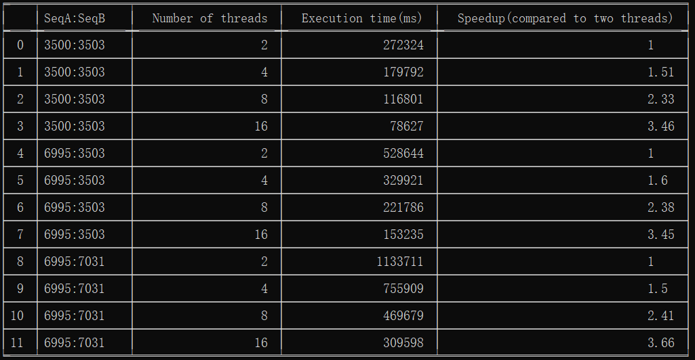

# Parallel Needleman Wunsch Algorithm
> Reference:
>
> V. Gancheva and I. Georgiev, "Multithreaded Parallel Sequence Alignment Based on Needleman-Wunsch Algorithm," 2019 IEEE 19th International Conference on Bioinformatics and Bioengineering (BIBE), 2019, pp. 165-169, doi: 10.1109/BIBE.2019.00037.

## How to use?

- Compile the project

  ```
  g++ -fopenmp ./NW_OMP_Protein.cpp -o NW_OMP_Protein
  ```

- Run the program

  There are different modes of this program:

  1. interactive mode----Set the input files and parameters manually

     ```
     ./NW_OMP_Protein.exe [--interactive]
     ```

  2. file mode----Use preset input parameters and generate the output files

     ```
     ./NW_OMP_Protein.exe --file
     ```

  3. help mode----Show the correct usage of the command

     ```
     ./NW_OMP_Protein.exe --help
     ```

  4. demonstration mode----Demonstrate the similarity matrix as an example to verify the correctness of the algorithm

     ```
     ./NW_OMP_Protein.exe --demo
     ```

- Show the table

  ```
  ./table.py
  ```

  
